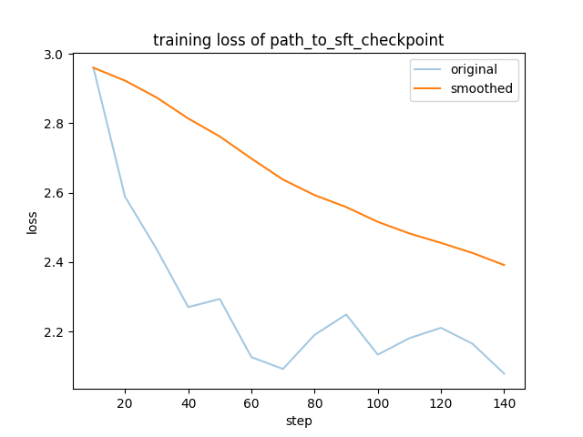
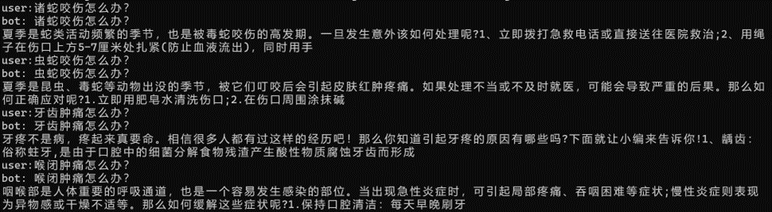
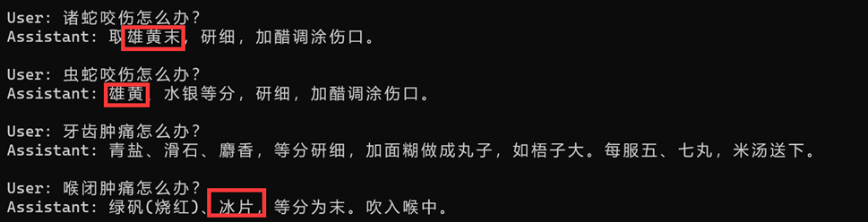

README
===========================

介绍用百川-7B，微调一个简单的中医大模型
****

|作者|baryccb|
|---|---
|公众号|万象新说


## 安装方法
```
# 下载安装微调框架 LLaMA-Efficient-Tuning，感谢作者！

# 将项目中的data文件夹，更新info.json（这个是《本草纲目》整理的），并更新dataset_info.json

# 下载百川-7B模型，并修改trainbaichuan.sh中的相应位置，执行。
```

## 相关结果

### 训练损失



### 微调前基座模型问答结果
 

### 微调后模型问答结果
 

### 文本处理与训练逻辑，请移步公众号文章，欢迎关注，讨论！
 


